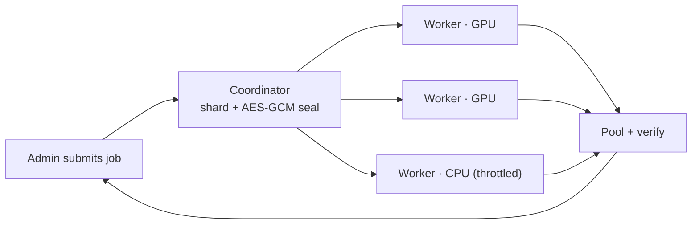

# MoreGPU

[](https://github.com/ArioMoniri/moregpu/actions/workflows/ci.yml)
[](LICENSE)
[](https://ariomoniri.github.io/moregpu/)

MoreGPU is a native GPU compute pool: an admin runs a coordinator, worker machines join with a one-liner over an outbound WebSocket, and submitted jobs are sharded, sealed, computed on each worker's GPU (or CPU), and pooled back with verification.

> ⚠️ **Authorized machines only.** Run MoreGPU on hardware you own or are explicitly permitted to use. Running workers on free or shared third‑party platforms — Google Colab, GitHub Actions and other CI runners, free/trial VPS — is **usually prohibited by their Terms of Service**. MoreGPU ships a generic worker joiner usable on any runtime you're permitted to use, and **no automation for evading** any platform's Terms of Service, quotas, or bot‑detection. **All legal and compliance responsibility is entirely yours.** See [ACCEPTABLE_USE.md](ACCEPTABLE_USE.md).

<p align="center">
  
</p>

---

## Run it

There are **two roles** — pick yours:

| | 👑 **Admin** | 🖥️ **Worker** |
|---|---|---|
| You… | run the pool's server, hold the tokens, submit jobs | lend a machine's GPU/CPU with a one-liner |
| Go to | [Admin track](#-admin-track) | [Worker track](#-worker-track) |

> Every pool generates its **own** tokens on first run — nobody shares another pool's credentials. Deno is the only prerequisite (one cross-platform binary; the apps run straight from the URL).

---

## 🔑 What is a token?

MoreGPU never shares credentials between pools. The **first time** you start the admin server, the setup wizard mints this pool's secrets and writes them to `.moregpu-server.json`. They persist, so every later restart reuses the same pool. Two of them are yours to hand out; one never leaves the server.

| Token | Minted by | Where you set it | What the holder can do |
|---|---|---|---|
| 👑 **Admin token** | wizard, first run (24 random bytes) | `Authorization: Bearer <admin-token>` on every admin call · the dashboard's token box · `adminToken` in the SDKs | Full control: submit jobs, read every job's input **and output**, read `/workers`, `/jobs`, `/logs`, `/metrics` |
| 🖥️ **Worker join token** | wizard, first run (18 random bytes) | `MOREGPU_TOKEN=…` in the worker one-liner | Enroll a machine as a compute worker |
| 🔒 **Tenant key** (AES-256-GCM) | wizard, first run (32 random bytes) | never displayed; stays in `.moregpu-server.json` | Seal / unseal shard payloads on the wire |

> [!IMPORTANT]
> 👑 **Admin token = pool control.** Anyone holding it can submit work and read the plaintext inputs/outputs of every job. Send it only over TLS/`https`, always in the `Authorization` header (never in a URL), and keep it in a secret manager — not a committed file.

> [!WARNING]
> 🔒 **Join token = the encryption key.** A valid join token is how a machine *earns* the shared AES-256-GCM tenant key (the server ships it in the `welcome` frame). MoreGPU is **single-trust-domain: workers hold the tenant key.** A leaked join token lets an attacker enroll a rogue worker, receive that key, and decrypt every sealed shard. Treat it like a password; send it only over `wss://`/TLS.

> [!TIP]
> **Rotate a leaked token:** stop the server (`Ctrl-C`), delete `.moregpu-server.json`, restart — the wizard mints fresh tokens **and a fresh tenant key**. Workers then re-join with the new join token.

📎 **The full cryptography model** — AES-256-GCM sealing, Ed25519 result signatures, the honest single-trust-domain limits, and the hardening/TEE roadmap — is documented in [SECURITY.md](SECURITY.md#cryptography-in-moregpu-today).

---

### 👑 Admin track

> [!TIP]
> 🖥️ **Run this on the machine that will host the pool.** Its first run prints your tokens + the worker command to hand out.

**1 · Start the admin server.**

```sh
deno run --allow-net --allow-env --allow-read --allow-write \
  https://raw.githubusercontent.com/ArioMoniri/moregpu/main/apps/coordinator/server.ts
```

> [!TIP]
> ☝️ **Solo, one machine?** Add `--worker` (and `--allow-run --allow-sys`) — your own GPU joins as `admin-slot`, so you can submit jobs immediately with no separate worker, just like a local GPU:
> ```sh
> deno run --allow-net --allow-env --allow-read --allow-write --allow-run --allow-sys \
>   https://raw.githubusercontent.com/ArioMoniri/moregpu/main/apps/coordinator/server.ts --worker
> ```

<details>
<summary><b>▶ What to expect · verify it's up · monitor · stop</b></summary>

**Expect:** a colored ASCII wizard printing the **Admin token**, the **Worker join token**, the dashboard URL (`http://HOST:8787`), and a ready-to-paste worker one-liner. Copy the two tokens — the admin token controls the pool; the join token lets machines enroll.

**Verify it's up:**
```sh
curl -s http://localhost:8787/health            # → {"ok":true,"fleet":0,"queue":0}
```
**Monitor:** open `http://HOST:8787` (dashboard: fleet, per-worker contribution + trends, queue, logs), or query the pool as a GPU slot:
```sh
curl -s http://localhost:8787/device -H "authorization: Bearer <admin-token>"
```
**Stop:** `Ctrl-C` in its terminal. Tokens/key persist in `.moregpu-server.json`, so the next start reuses the same pool.

Optional env: `PORT`, `MOREGPU_HOST`, `MOREGPU_TLS_CERT`+`MOREGPU_TLS_KEY` (→ `wss://` TLS), `MOREGPU_DUTY`.

</details>

**2 · Submit a job.** Benchmark mode (the pool generates data), or send your own tensors (data mode).

```sh
curl -X POST http://ADMIN:8787/submit -H "authorization: Bearer <admin-token>" \
  -H "content-type: application/json" -d '{"kernel":"matmul","size":512}'
```

<details>
<summary><b>▶ What to expect · send your own data · async · verify</b></summary>

**Expect:** a job record `{"status":"done","gflops":…,"verified":true,"shards":[…]}`. `verified:true` means the pooled GPU result matched the CPU reference.

**Send your own tensors and get results back** (data mode) — easiest via the [SDKs](#use-it-from-your-code):
```python
pool.matmul([1,2,3, 4,5,6], [7,8, 9,10, 11,12], M=2, N=2, K=3)   # → [58, 64, 139, 154]
```
**Async (GPU-style submit + poll):** add `?async=1` to get a job handle immediately, then poll `GET /jobs/<id>`.

Kernels: `matmul, vector_add, vector_mul, saxpy, relu, scale, gelu, softmax, layernorm` (extensible). Enough to compose a real transformer block — SDK helpers `pool.attention()`, `pool.linear()`, `pool.mlp()` are verified in [`examples/verify_workloads.py`](examples/verify_workloads.py); see also [AI usage](docs/AI_USAGE.md). The whole fleet is presented as one **virtual GPU slot** — `GET /device` returns its backends, kernels, limits, queue and capabilities.

</details>

The dashboard (any browser, even if the server host is headless/CLI-only) shows the virtual-GPU view, per-worker live contribution + trend sparklines, the queue, and the error/debug log. Turnkey Grafana bundle in [`config/observability`](config/observability). Full ops guide: [docs/ADMIN.md](docs/ADMIN.md).

<p align="center">
  
  <br><sub>The live admin dashboard: virtual-GPU slot, per-worker contribution + trends, per-kernel jobs, error/debug log. The <code>admin-slot</code> row is this machine's built-in worker.</sub>
</p>

---

### 🖥️ Worker track

> [!TIP]
> 🖥️ **Run this on each machine you want to lend** (with the admin's join token). Installs Deno if needed; uses the GPU (WebGPU → Metal / Vulkan / D3D12) or falls back to CPU. Nothing shows on screen — it only dials **out**.

```sh
# Linux / macOS
curl -fsSL https://raw.githubusercontent.com/ArioMoniri/moregpu/main/scripts/install.sh \
  | MOREGPU_SERVER=wss://ADMIN:8787/ws MOREGPU_TOKEN=<join-token> sh
```
```powershell
# Windows (PowerShell)
$env:MOREGPU_SERVER="wss://ADMIN:8787/ws"; $env:MOREGPU_TOKEN="<join-token>"
irm https://raw.githubusercontent.com/ArioMoniri/moregpu/main/scripts/install.ps1 | iex
```

<details>
<summary><b>▶ What to expect · verify you joined · monitor your impact · stop · run as a service</b></summary>

**Expect:** log lines like `[worker] <name> · backend=gpu:… · server=wss://…` then `[worker] joined pool · duty ceiling=60% · adaptive …`. It keeps running and pulling work; you'll see `… done in Nms on gpu/cpu` as shards complete.

**Verify you joined:** you appear in the admin's dashboard / `/workers` with your backend and a live contribution **share**. The installer self-heals (retries the Deno install; supervised restart loop).

**Monitor your impact:** the adaptive throttle keeps *total* machine utilization under `MOREGPU_MAX_UTIL` (default 85%) — the harder **you** use your PC, the less the pool takes. Watch the worker log, or your row in the admin dashboard.

**Stop:**
| How you started it | Stop command |
|---|---|
| Foreground | `Ctrl-C` |
| Service (`MOREGPU_SERVICE=1`) | `moregpu stop` · or `systemctl --user stop moregpu-worker` (Linux) · `launchctl unload ~/Library/LaunchAgents/dev.moregpu.worker.plist` (macOS) · `schtasks /end /tn MoreGPUWorker` (Windows) |
| tmux (`MOREGPU_TMUX=1`) | `tmux kill-session -t moregpu` |

**Run as a reboot-surviving, self-healing service:** add `MOREGPU_SERVICE=1` to the one-liner.

</details>

**Worker options** (environment variables):

| Variable | Effect |
|---|---|
| `MOREGPU_SERVICE=1` | Install a reboot-surviving service (systemd / launchd / Windows task); restarts after logout or reboot. |
| `MOREGPU_THROTTLE=0.4` | Duty-cycle **ceiling** (`0.05`–`1`). The effective duty adapts below this from the machine's live load. |
| `MOREGPU_MAX_UTIL=0.85` | Total-utilization cap. The pool uses only the slack below it, backing off as its user gets busier. |
| `MOREGPU_SCHEDULE` | **When** to contribute: `always` (default) · `idle-only` (only when the machine is idle) · `HH:MM-HH:MM` active window in local time (may wrap midnight, e.g. `22:00-07:00` = nights only). Outside the window the worker takes no new work; in-flight shards always finish. |
| `MOREGPU_FORCE_CPU=1` (or `--cpu`) | Contribute with CPU only (skip the GPU). |
| `MOREGPU_NAME` | Name for this worker in the dashboard. |
| `MOREGPU_TMUX=1` | Run detached inside a tmux session. |

> **You stay in control of your own machine.** Set `MOREGPU_SCHEDULE` to lend it only nights/when idle, cap it with `MOREGPU_THROTTLE`, or just `Ctrl-C` / `moregpu stop` any time. The admin can also pause, cap, reschedule, or remove any worker remotely (below) — but they can never make your machine take more than *your* `MOREGPU_MAX_UTIL` slack.

> [!TIP]
> 🔒 **Dedicated hardware isolation (Linux).** Pin a worker to bounded, isolated resources (a cgroups‑v2 scope: CPU quota, cpuset, memory cap, idle I/O) so the pool can never disturb you, via [`scripts/isolate-linux.sh`](scripts/isolate-linux.sh) or `moregpu isolate`:
> ```sh
> MOREGPU_CPU_QUOTA=40% MOREGPU_CPUS=2-3 MOREGPU_MEM_MAX=2G \
>   sudo -E moregpu isolate --server wss://ADMIN:8787/ws --token <join-token>
> ```
> The **memory cap + idle I/O/nice** always apply. The **CPU quota + cpuset** need a *system* scope (`sudo`) or a one-time admin delegation to your user slice (`Delegate=cpu cpuset io memory pids` on `user@.service`) — without it, the script warns and degrades to memory-cap + low priority. (GPU-side, MIG/MPS only bind a CUDA backend, not this WebGPU worker — it uses device pinning + the adaptive duty throttle.)

> **Or use the [`moregpu` CLI](scripts/moregpu)**: `moregpu serve [--worker]`, `moregpu join --server … --token … [--schedule 22:00-07:00]`, `moregpu isolate …`, `moregpu stop`, `moregpu status`, and admin fleet control — `moregpu workers`, `moregpu pause <id>`, `moregpu resume <id>`, `moregpu set <id> <duty>`, `moregpu rm <id>`.

---

## ✅ How to test it works

Copy-paste checks for each part. Set your values once:

```sh
ADMIN="http://localhost:8787"        # your admin server
TOK="<admin-token>"                  # from the wizard
```

<details>
<summary><b>▶ Server is up · a worker joined · submit runs · data mode · metrics · signatures</b></summary>

```sh
# 1) server is up (public endpoint, no token)
curl -s "$ADMIN/health"                                   # → {"ok":true,"fleet":N,"queue":0}

# 2) the pool shows up as a GPU slot (device descriptor)
curl -s "$ADMIN/device" -H "authorization: Bearer $TOK"   # name, backends, kernels, limits, capabilities

# 3) a worker joined — it appears here with a live contribution share
curl -s "$ADMIN/workers" -H "authorization: Bearer $TOK"  # [{"id":"…","backend":"gpu","share":…}]

# 4) submit a benchmark job — expect "verified":true and "signed":true
curl -s -X POST "$ADMIN/submit" -H "authorization: Bearer $TOK" \
  -H 'content-type: application/json' -d '{"kernel":"matmul","size":512}'

# 5) DATA MODE — send tensors, get the product back (verify [58,64,139,154]) via the SDK:
python3 -c 'from examples.moregpu_client import MoreGPU; import os; \
  print(MoreGPU(os.environ["ADMIN"], os.environ["TOK"]).matmul([1,2,3,4,5,6],[7,8,9,10,11,12],M=2,N=2,K=3))'

# 6) Prometheus metrics (feed Grafana)
curl -s "$ADMIN/metrics" -H "authorization: Bearer $TOK" | grep moregpu_fleet
```

**What "pass" looks like:** `/health` returns `ok:true`; `/workers` lists your machine(s); the submit returns
`"verified":true,"signed":true` (Ed25519-signed result); data-mode matmul prints `[58.0, 64.0, 139.0, 154.0]`.

</details>

<details>
<summary><b>▶ Run the full self-test locally (server + workers + every kernel + real ML workloads)</b></summary>

```sh
git clone https://github.com/ArioMoniri/moregpu && cd moregpu
npm install && npm test          # 113 unit tests (protocol, gpu, scheduler, crypto, client, …)
bash examples/e2e.sh             # end-to-end: server + a GPU + a throttled CPU worker + a sealed job
bash scripts/smoke.sh            # smoke-tests every endpoint + every kernel against a live pool
```

Then, with a pool running, replay the workloads a **real GPU user** runs — a Linear layer,
a 2-layer MLP, LayerNorm, a softmax head, and a full single-head attention block — each
checked against a CPU reference:

```sh
MOREGPU_BASE=http://localhost:8787 MOREGPU_ADMIN_TOKEN=<admin-token> \
  python3 examples/verify_workloads.py     # → 7 passed, 0 failed (all match to ~1e-8)
```

</details>

## Use it from your code

Drive the pool from an application with the client SDK, or the CLI.

Install from the [**latest GitHub Release**](https://github.com/ArioMoniri/moregpu/releases/latest) — no registry account needed:

```sh
# Python SDK (standard library only) — matmul, attention(), linear(), mlp(), reductions
pip install https://github.com/ArioMoniri/moregpu/releases/latest/download/moregpu_client-0.3.0-py3-none-any.whl
# TypeScript/JS SDK (Deno / Node / browser)
npm install https://github.com/ArioMoniri/moregpu/releases/latest/download/moregpu-client-0.3.0.tgz
# `moregpu` CLI — Homebrew cask (installs Deno), or one curl:
brew install --cask ArioMoniri/moregpu/moregpu
curl -fsSL https://raw.githubusercontent.com/ArioMoniri/moregpu/main/scripts/moregpu -o /usr/local/bin/moregpu && chmod +x /usr/local/bin/moregpu
```

> [!NOTE]
> The SDKs are **not yet on PyPI / npmjs** — publishing there needs the maintainer's registry tokens (not available in this environment, so it can't be done from here). The Release artifacts above install today with no account; the exact one-command publish steps are in [CONTRIBUTING.md](CONTRIBUTING.md#releasing--publishing). Once on PyPI/npm this becomes `pip install moregpu-client` / `npm install @moregpu/client`.

**JavaScript / TypeScript** ([`@moregpu/client`](packages/client), runs in Deno / Node / browsers):

```ts
import { MoreGPUClient } from '@moregpu/client';
const pool = new MoreGPUClient({ baseUrl: 'http://ADMIN:8787', adminToken: '<admin-token>' });
const C = await pool.matmul([1,2,3, 4,5,6], [7,8, 9,10, 11,12], 2, 2, 3); // send tensors, get the product
const { output } = await pool.run('relu', { a: [-1, 2, -3, 4] });         // any kernel on your own data
const gpu = await pool.gpu();                                             // pool state + per-worker contribution
```

**Python** (`pip install moregpu-client`, standard library only):

```python
from moregpu import MoreGPU                                        # the installed package's module is `moregpu`
pool = MoreGPU("http://ADMIN:8787", "<admin-token>")
pool.matmul([1,2,3, 4,5,6], [7,8, 9,10, 11,12], M=2, N=2, K=3)   # → [58, 64, 139, 154]
pool.run("relu", [-1, 2, -3, 4])                                  # any kernel on your own data
```

> Prefer zero-install? Copy the single-file [`examples/moregpu_client.py`](examples/moregpu_client.py) and use `from moregpu_client import MoreGPU` instead — same API, no `pip`.

For AI/ML workloads — which kernels map to which ops, batching patterns, and how to add a kernel — see [**docs/AI_USAGE.md**](docs/AI_USAGE.md).

## Monitoring (Grafana)

The admin server exposes a Prometheus `/metrics` endpoint (fleet, queue, throughput, and **per-worker contribution**). A turnkey Prometheus + Grafana bundle with a pre-provisioned dashboard is in [`config/observability`](config/observability):

```sh
cd config/observability
export MOREGPU_ADMIN_TOKEN=<admin-token>
export MOREGPU_TARGET=host.docker.internal:8787   # your admin host:port
docker compose up -d                              # Grafana → http://localhost:3000
```

<p align="center">
  
  <br><sub>The pre-provisioned Grafana dashboard, live: fleet size, queue depth, units pooled, jobs done/failed, avg user-util & pool-duty, and per-worker share + units (here <code>cpu-x</code> and the built-in <code>admin-slot</code>).</sub>
</p>

> [!NOTE]
> **Why Prometheus + Grafana?** For a single-admin self-hosted pool it's still the pragmatic 2026 choice — tiny footprint, ubiquitous, dashboards included. The `/metrics` endpoint is plain OpenMetrics, so if you outgrow it you can point **VictoriaMetrics** (metrics at scale) or an OTel-native all-in-one like **OpenObserve** / **SigNoz** at the same endpoint without changing MoreGPU.

---

## How it works

<sub>The animation at the top is rendered with <a href="scripts/manim/system.py">Manim</a>; a live Lottie version is on the <a href="https://ariomoniri.github.io/moregpu/">project site</a>.</sub>

**Adaptive per-user throttle.** Each worker samples its own machine's load and lowers its pool duty as that machine's user gets busier, keeping total system utilization under a cap (`MOREGPU_MAX_UTIL`, default 85%). Use the PC harder and the pool quietly steps back, so the user is not disturbed and power draw stays low. CPU-only machines contribute to the same pool. Workers connect outbound only; enrolling a machine never requires opening an inbound port. Set `MOREGPU_SERVICE=1` for reboot survival and the supervised, self-healing restart loop. Provide `MOREGPU_TLS_CERT` and `MOREGPU_TLS_KEY` to serve over `wss://`. Each pool's tokens and encryption key are generated by the wizard on first run, so pools are isolated.

Job flow — submit, shard, seal, compute, pool, verify:



Deployment topology — admin coordinator and outbound-only workers:

<p align="center">
  
</p>

---

## 🎮 Can it run what I run?

MoreGPU is an honest, **verified fp32** linear-algebra service — not a CUDA replacement. Here's what a GPU user gets (✅ native · 🧩 compose from primitives · 🟡 partial · ❌ not supported):

| Workload | | How / why |
|---|---|---|
| Dense fp32 matmul / GEMM | ✅ | **Workgroup-tiled WGSL GEMM on the GPU** (shared-memory tiling), verified. fp32 only, **no tensor cores** → correct but slower than cuBLAS. |
| Elementwise + activations (add/mul/scale/saxpy/relu/**gelu**) | ✅ | First-class WGSL kernels — run **on the GPU** on a GPU worker (CPU otherwise). Memory-bound, so the GPU mainly relieves the CPU rather than adding raw speed. |
| Softmax / LayerNorm | ✅ | Row-wise WGSL reductions (one workgroup per row) **on the GPU** on a GPU worker; CPU otherwise. Match a CPU reference to ~1e-8. |
| Scaled dot-product attention (one head) | 🧩 | `matmul(Q,Kᵀ)→scale→softmax→matmul(·,V)` — **verified** to 2e-3 vs a float64 reference ([`verify_workloads.py`](examples/verify_workloads.py) check #7). One-call `pool.attention(Q,K,V,seq,d)` SDK helper. Not flash-attention; no KV cache. |
| Transformer block / small MLP inference | 🧩 | Compose LN→matmuls→attention→FFN. You orchestrate the graph from the SDK; weights are per-request, no residency. |
| Reductions (sum/mean/dot/norm) | 🧩 | Via GEMM tricks (`dot = (1×K)·(K×1)`, etc.); `pool.sum/mean/dot/norm` SDK helpers. Convenience, not throughput — each runs on one worker/one thread. |
| Large / out-of-core matmul | 🟡 | Sharded across workers + pooled — bounded by WGSL cores + WAN, not NVLink. |
| Monte-Carlo / RNG-heavy sims | 🟡 | You supply random inputs (host-side RNG); the pool does the arithmetic. |
| Full LLM inference (checkpoints, tokenizer, KV cache) | ❌ | No model loader/tokenizer/sampling/KV-cache, no fp16/int8. Impractical to hand-compose at scale. |
| Training (autograd / backprop / optimizer) | ❌ | No autograd or gradient/optimizer kernels. Not a training platform. |
| Conv2d / CNNs | 🧩 | im2col on the host, then pooled matmul — runnable, CPU-checked demo in [`examples/conv2d_im2col.py`](examples/conv2d_im2col.py). Off-GPU unfold. |
| CUDA/PTX kernels · Stable Diffusion · rendering (OptiX) · NVENC · fp16/int8 tensor cores | ❌ | WGSL backend, compute-only, fp32 — none of these paths exist. |

**In one line:** every kernel it ships — tiled matmul, elementwise/activations, softmax and layernorm — runs **on your real GPU** (WGSL → Metal/Vulkan/D3D12) on a GPU worker, with verified fp32 results, and you **compose** them into attention, transformer blocks, and small classifiers. It is not a drop-in for training, big-model inference, tensor-core speed, CUDA kernels, or graphics.

> [!NOTE]
> **Why not CUDA / fp16 / full LLMs?** MoreGPU's backend is **WebGPU (WGSL)** — the portable path that runs the same kernels on NVIDIA, AMD, Apple, and Intel GPUs. WebGPU is fp32 compute-only: no tensor cores, no fp16/int8, no CUDA/PTX, and no autograd. Full-model inference and training would need a **separate native CUDA/cuBLAS worker type** (NVIDIA-only, fp16 + tensor cores + a real autograd/KV-cache stack) — a large, honest roadmap item, **not built**. What ships today is a correct, verified fp32 primitive set you can compose; it will not masquerade as a CUDA/training platform it isn't.

> [!NOTE]
> **What runs on the GPU:** on a GPU worker, **all** kernels execute on-device (WGSL → Metal/Vulkan/D3D12) — tiled matmul, elementwise/activations, and softmax/layernorm reductions. A CPU-only worker runs the identical kernels on the CPU. Either way the coordinator cross-checks the pooled result against a CPU reference, so every path returns the same verified fp32 output.

## Authorized use only

Run workers only on machines you own or are explicitly authorized to use. MoreGPU is neutral infrastructure: it ships a generic authorized-runtime worker joiner (usable on any runtime you're permitted to use, including a notebook you control such as [`examples/colab_worker.ipynb`](examples/colab_worker.ipynb)) and **no automation for evading** any platform's Terms of Service, quotas, or bot-detection. Using it on third-party platforms is very often prohibited by their Terms of Service. All responsibility, legal risk, and compliance rest entirely with the operator. See the acceptable-use notice above and `LICENSE` for full terms.

## License

Apache-2.0 © 2026 Ariorad Moniri. Repository: https://github.com/ArioMoniri/moregpu

The software is provided AS IS, without warranty of any kind, and the authors accept no liability.
