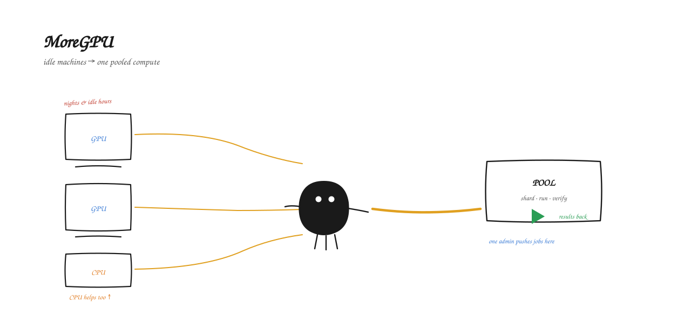
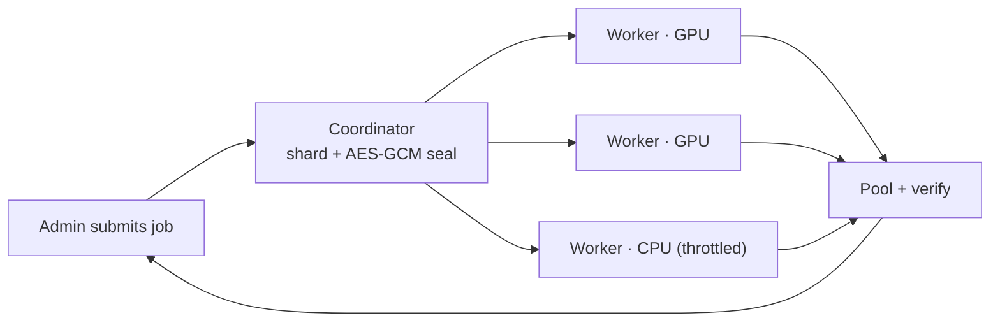
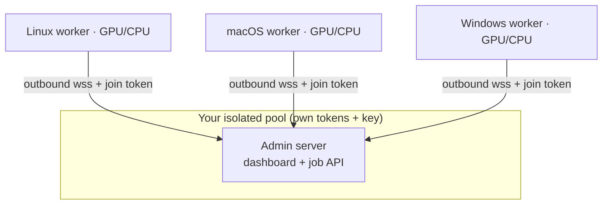

# MoreGPU

[](https://github.com/ArioMoniri/moregpu/actions/workflows/ci.yml)
[](LICENSE)
[](https://ariomoniri.github.io/moregpu/)

MoreGPU is a native GPU compute pool: an admin runs a coordinator, worker machines join with a one-liner over an outbound WebSocket, and submitted jobs are sharded, sealed, computed on each worker's GPU (or CPU), and pooled back with verification.

> ⚠️ **Authorized machines only.** Run MoreGPU on hardware you own or are explicitly permitted to use. Running workers on free or shared third‑party platforms — Google Colab, GitHub Actions and other CI runners, free/trial VPS — is **usually prohibited by their Terms of Service**, and this project ships no tooling to do so. **All legal and compliance responsibility is entirely yours.** See [ACCEPTABLE_USE.md](ACCEPTABLE_USE.md).

<p align="center">
  
</p>

---

## Run it

Three steps. Every pool generates its own tokens on first run, so nobody shares another pool's credentials.

### 1. Start the admin server

Run the coordinator. Deno is the only prerequisite — a single cross-platform binary that runs the server directly from the URL, the same way on every OS. On its first run the server launches a setup wizard that generates this pool's admin token, worker join token, and encryption key, then prints the exact worker command to copy.

```sh
deno run --allow-net --allow-env --allow-read --allow-write \
  https://raw.githubusercontent.com/ArioMoniri/moregpu/main/apps/coordinator/server.ts
```

The dashboard serves on `http://HOST:8787`. Optional environment variables: `PORT`, `MOREGPU_HOST`, `MOREGPU_TLS_CERT` + `MOREGPU_TLS_KEY` (enables `wss://` TLS), `MOREGPU_DUTY`. Keep the printed admin and join tokens; the admin token controls the pool, and the join token lets machines enroll.

### 2. Join machines as workers

On each machine you own or are authorized to use, run the one-liner with the join token from step 1. The worker makes an outbound WebSocket connection to the admin server, installs Deno if needed, and starts pulling work. GPU machines compute on the physical GPU via WebGPU (Metal / Vulkan / D3D12); machines without a usable GPU fall back to CPU and still contribute.

Linux / macOS:

```sh
curl -fsSL https://raw.githubusercontent.com/ArioMoniri/moregpu/main/scripts/install.sh \
  | MOREGPU_SERVER=wss://ADMIN:8787/ws MOREGPU_TOKEN=<join-token> sh
```

Windows (PowerShell) — set the two environment variables first, then run the installer:

```powershell
$env:MOREGPU_SERVER = "wss://ADMIN:8787/ws"
$env:MOREGPU_TOKEN  = "<join-token>"
irm https://raw.githubusercontent.com/ArioMoniri/moregpu/main/scripts/install.ps1 | iex
```

Worker environment options:

| Variable | Effect |
|---|---|
| `MOREGPU_SERVICE=1` | Install a reboot-surviving service (systemd on Linux, launchd on macOS, a scheduled task on Windows) so the worker restarts after logout or reboot. |
| `MOREGPU_THROTTLE=0.4` | Duty-cycle **ceiling**, range `0.05`–`1`. The effective duty adapts below this in real time from the machine's own load. |
| `MOREGPU_MAX_UTIL=0.85` | Total-utilization cap. The pool only uses the slack below it, so the worker backs off as its user gets busier. |
| `MOREGPU_FORCE_CPU=1` or `--cpu` | Skip the GPU and compute on CPU only. |
| `MOREGPU_NAME` | Human-readable name for this worker in the dashboard. |
| `MOREGPU_TMUX=1` | Run the worker inside a tmux session. |

The installer self-heals: it retries the Deno install and runs the worker under a supervised restart loop.

### 3. Submit a job (or use the dashboard)

Authenticate with the admin token from step 1. Submit over HTTP, or open the dashboard at `http://ADMIN:8787` and submit there.

```sh
curl -X POST http://ADMIN:8787/submit \
  -H "authorization: Bearer <admin-token>" \
  -H "content-type: application/json" \
  -d '{"size":1024}'
```

The coordinator shards the job across connected workers, AES-GCM seals each work unit so only ciphertext travels the wire, collects and pools the results, and verifies them. Task types available today: `matmul`, `vector_add`, `vector_mul`, `saxpy`, `relu`, `scale`. The set is extensible — add a WGSL kernel plus a CPU reference to support a new task type.

The fleet is presented as one virtual GPU with a Slurm-like job queue. The admin dashboard (usable where only a command line exists) shows the virtual-GPU view, per-worker live load and adaptive duty, the job queue, and an errors/debug log; a Prometheus `/metrics` endpoint feeds Grafana. See the [admin guide](docs/ADMIN.md).

---

## How it works

<p align="center">
  
</p>

<p align="center"><sub>Animated version and full docs on the <a href="https://ariomoniri.github.io/moregpu/">project site</a>.</sub></p>

**Adaptive per-user throttle.** Each worker samples its own machine's load and lowers its pool duty as that machine's user gets busier, keeping total system utilization under a cap (`MOREGPU_MAX_UTIL`, default 85%). Use the PC harder and the pool quietly steps back, so the user is not disturbed and power draw stays low. CPU-only machines contribute to the same pool. Workers connect outbound only; enrolling a machine never requires opening an inbound port. Set `MOREGPU_SERVICE=1` for reboot survival and the supervised, self-healing restart loop. Provide `MOREGPU_TLS_CERT` and `MOREGPU_TLS_KEY` to serve over `wss://`. Each pool's tokens and encryption key are generated by the wizard on first run, so pools are isolated.

Job flow — submit, shard, seal, compute, pool, verify:



Deployment topology — admin coordinator and outbound-only workers:



---

## Authorized use only

Run workers only on machines you own or are explicitly authorized to use. MoreGPU is neutral infrastructure and does not provide any automation for turning free CI runners, notebook services, or trial VPS instances into pool workers; using it on third-party platforms is very often prohibited by their Terms of Service. All responsibility, legal risk, and compliance rest entirely with the operator. See the acceptable-use notice above and `LICENSE` for full terms.

## License

Apache-2.0 © 2026 Ariorad Moniri. Repository: https://github.com/ArioMoniri/moregpu

The software is provided AS IS, without warranty of any kind, and the authors accept no liability.
