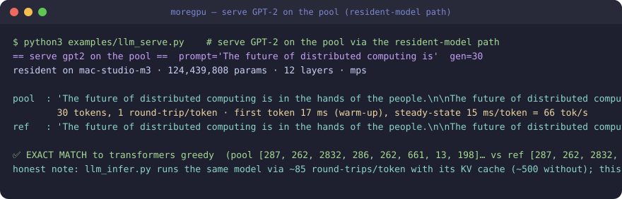
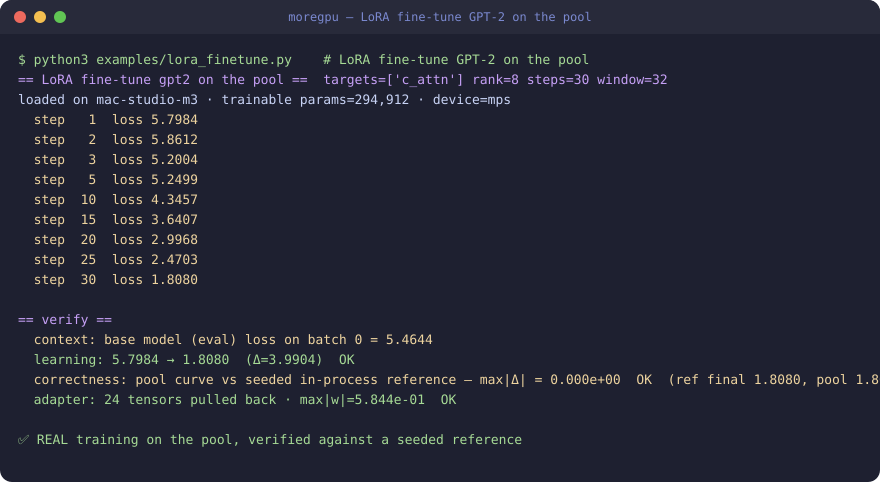
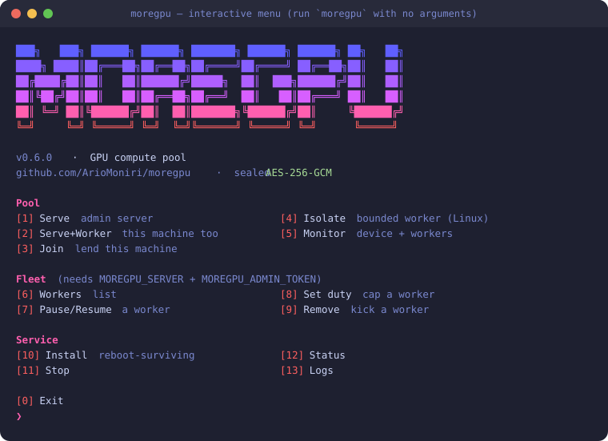
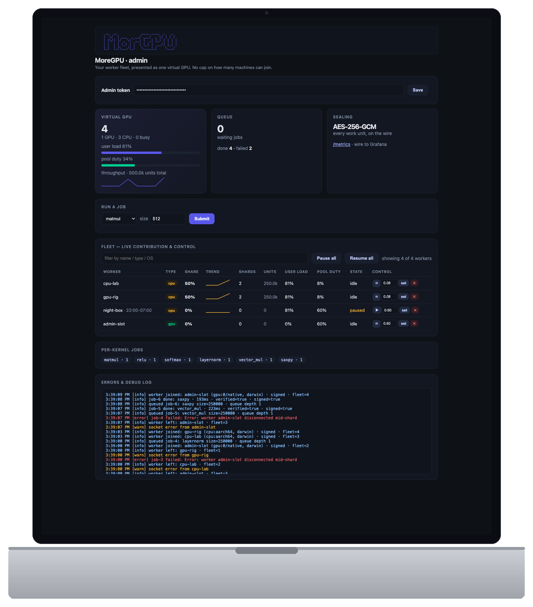
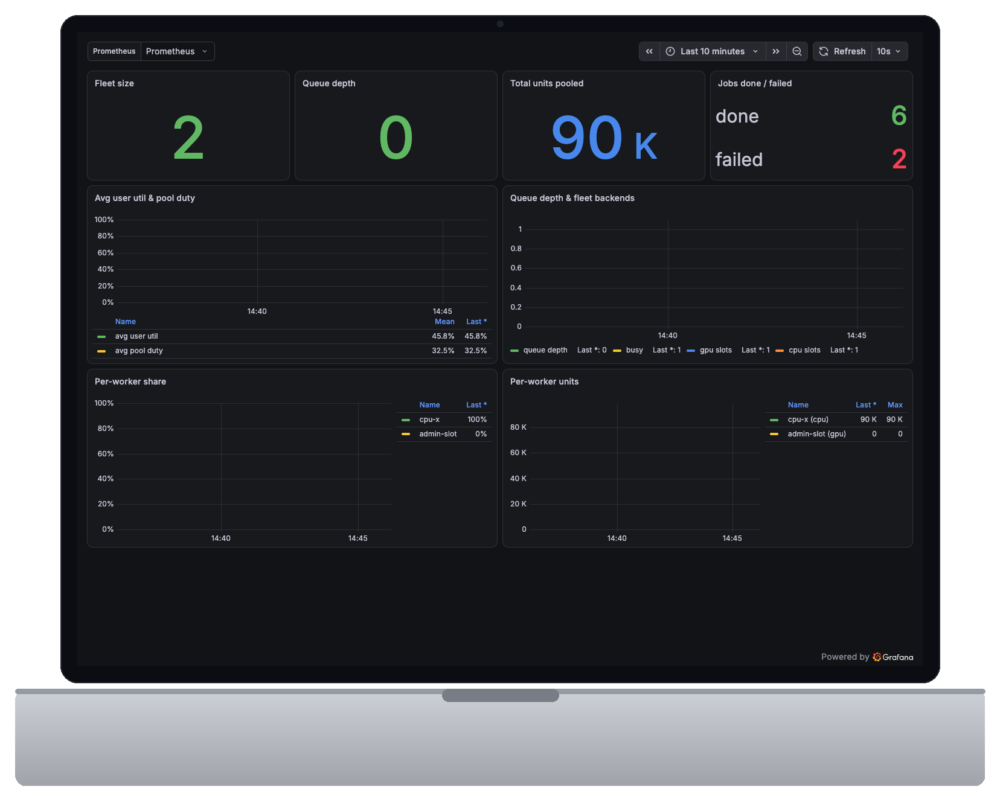
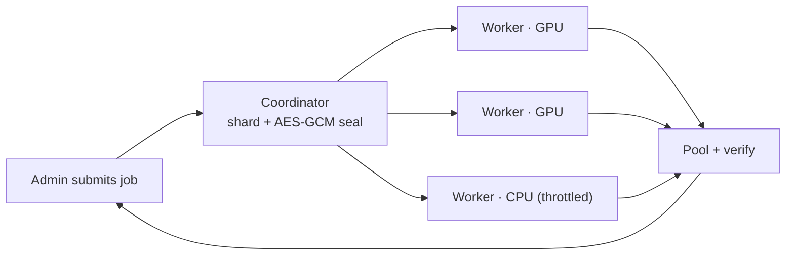
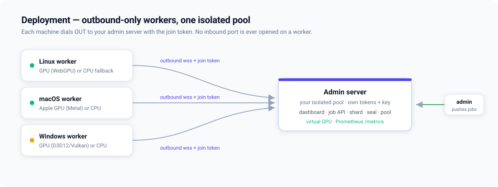

# MoreGPU

[](https://github.com/ArioMoniri/moregpu/actions/workflows/ci.yml)
[](https://pypi.org/project/moregpu-client/)
[](LICENSE)
[](https://ariomoniri.github.io/moregpu/)

MoreGPU is a native GPU compute pool: an admin runs a coordinator, worker machines join with a one-liner over an outbound WebSocket, and submitted jobs are sharded, sealed, computed on each worker's GPU (or CPU), and pooled back with verification.

> ⚠️ **Authorized machines only.** Run MoreGPU on hardware you own or are explicitly permitted to use. Running workers on free or shared third‑party platforms — Google Colab, GitHub Actions and other CI runners, free/trial VPS — is **usually prohibited by their Terms of Service**. MoreGPU ships a generic worker joiner usable on any runtime you're permitted to use, and **no automation for evading** any platform's Terms of Service, quotas, or bot‑detection. **All legal and compliance responsibility is entirely yours.** See [ACCEPTABLE_USE.md](ACCEPTABLE_USE.md).

<p align="center">
  
</p>

---

## 🎮 Can it run what I run?

MoreGPU is an honest, **verified fp32** linear-algebra service — not a CUDA replacement. Here's what a GPU user gets (✅ native · 🧩 compose from primitives · 🟡 partial · ❌ not supported):

| Workload | | How / why |
|---|---|---|
| Dense fp32 matmul / GEMM | ✅ | **Workgroup-tiled WGSL GEMM on the GPU** (shared-memory tiling), verified. fp32 only, **no tensor cores** → correct but slower than cuBLAS. |
| Elementwise + activations (add/mul/scale/saxpy/relu/**gelu**) | ✅ | First-class WGSL kernels — run **on the GPU** on a GPU worker (CPU otherwise). Memory-bound, so the GPU mainly relieves the CPU rather than adding raw speed. |
| Softmax / LayerNorm | ✅ | Row-wise WGSL reductions (one workgroup per row) **on the GPU** on a GPU worker; CPU otherwise. Match a CPU reference to ~1e-8. |
| Scaled dot-product attention (one head) | 🧩 | `matmul(Q,Kᵀ)→scale→softmax→matmul(·,V)` — **verified** to 2e-3 vs a float64 reference ([`verify_workloads.py`](examples/verify_workloads.py) check #7). One-call `pool.attention(Q,K,V,seq,d)` SDK helper. Not flash-attention, but the GPT-2 demo now adds an incremental **KV cache** (below). |
| Transformer block / small MLP inference | 🧩 | Compose LN→matmuls→attention→FFN — runnable in [`tiny_llm.py`](examples/tiny_llm.py). |
| Split a model across workers/GPUs (pipeline) | 🧩 | **Weight residency**: `pool.upload_weight()` pins a layer's weights on a worker (sent once); `pool.matmul_resident()` runs where they live. Demo: [`pipeline_parallel.py`](examples/pipeline_parallel.py). **fp16 weights** supported (`dtype='f16'`, half the memory). |
| Reductions (sum/mean/dot/norm) | 🧩 | Via GEMM tricks (`dot = (1×K)·(K×1)`, etc.); `pool.sum/mean/dot/norm` SDK helpers. Convenience, not throughput — each runs on one worker/one thread. |
| Large / out-of-core matmul | 🟡 | Sharded across workers + pooled — bounded by WGSL cores + WAN, not NVLink. |
| Monte-Carlo / RNG-heavy sims | 🟡 | You supply random inputs (host-side RNG); the pool does the arithmetic. |
| Small LLM inference (e.g. GPT-2 124M) | 🟡→✅ | **A real GPT-2 runs on the pool** — [`examples/llm_infer.py`](examples/llm_infer.py) pins the 12 layers resident, runs the full forward, and matches Hugging Face **exactly** (fp32 or fp16), now with a **client-side KV cache** (incremental decode, ~4× faster per token on the WGSL path, still exact). For real speed, the new **native torch worker** holds the model resident on-device and serves at up to **~66 tok/s** warm on an unloaded machine (~6–23 tok/s under load) with the same **exact match** — [`examples/llm_serve.py`](examples/llm_serve.py). |
| Fast small-LLM serving (low latency) | 🟡 | The new **native torch worker** ([`apps/worker/worker_torch.py`](apps/worker/worker_torch.py), Apple MPS / CUDA) holds a whole model resident on-device and runs the **entire forward per call** — one round-trip per token instead of ~500 — so GPT-2 serves at up to **~66 tok/s** warm/unloaded (~6–23 tok/s under load) with a token-for-token **exact match** to transformers ([`llm_serve.py`](examples/llm_serve.py)). It's an **opt-in native tier** (admin-installed, not the zero-install WGSL worker). |
| Download-free serving (fleet = pure GPU compute, no worker download) | 🟡 | **`POST /model/load {push:true}`** (or the `/chat` page's *download-free* checkbox): instead of the worker fetching the model, the **coordinator** (admin box) pulls `config` + `safetensors` + `tokenizer` from HF over HTTPS **once** and streams the raw bytes to the worker in sealed chunks. The worker stages them in a **RAM-backed dir** (`/dev/shm` when present → **zero SSD**) and loads with HF's own `from_pretrained(local_files_only=True)`, then deletes staging — so the fleet **never touches the hub** and keeps **no model on disk**. The resulting model is loaded from the identical bytes, so it's **the same model as a normal load** — verified **token-for-token identical** on a test model. Because it's a **one-time** transfer (not the per-token pipe), it tolerates a slow/flaky tunnel far better. Response reports `staging: ram\|disk` honestly (macOS has no `/dev/shm` → `disk`, transient). Over a public tunnel the load runs **async** (`{push:true, async:true}` → returns immediately; poll `GET /model/status?id=…`) so a long push doesn't exceed the tunnel's request timeout — the `/chat` page does this automatically. Pipeline sharding is likewise async (`POST /model/shard {push,async:true}` + `GET /model/shard_status`), and **`POST /model/shard_generate`** runs the whole greedy loop **on the coordinator**, streaming one token per line — so hosting a model across the fleet **completes over a slow/tunneled link in a single request** (possible, not fast). **Text-in/text-out chat over a sharded model** works too — the first stage holds the tokenizer, so **`POST /model/shard_chat {prompt}`** (and the `/chat` page's **shard across fleet** toggle) tokenizes → pipes every token through all stages → decodes, so **every node contributes to each chat token** (verified: 3 nodes, equal ops). |
| Big-model inference across machines (pipeline sharding) | 🟡 | **Pipeline-parallel sharding** ([`llm_shard.py`](examples/llm_shard.py)): split a model's transformer layers into contiguous stages, one per torch worker, piping only **activations** (`~[seq×hidden]`, never weights) — the low-bandwidth path (Petals / Mesh-LLM style). Works for **GPT-2 *and* Llama-family** (RMSNorm/RoPE) — verified token-for-token **exact match** for GPT-2 (6+6 split) *and* SmolLM-135M (15+15 split) across 2 workers, each worker holding **only its stage**. **Download-free** too (`POST /model/shard {push:true}`): the coordinator fetches the model once and streams each worker only its stage's tensors (its layer slice + embeddings/head on the ends), rebuilt as a per-stage safetensors — so the fleet never touches the hub; verified byte-for-byte identical output to a full forward. *Honest note:* sharding is for **capacity** (a model too big for one node), **not speed** — a single stream flows stage→stage sequentially, so over a WAN it's **slower per token** than one node, and per-token forwards can 502 on a flaky free tunnel. A real 7B would use more/bigger workers. Still no int8/tensor cores. |
| Training / fine-tuning (LoRA) | 🟡 | **LoRA fine-tuning on the torch worker** — single-worker ([`lora_finetune.py`](examples/lora_finetune.py)) *and* **distributed across N workers via DiLoCo** ([`lora_distributed.py`](examples/lora_distributed.py)): each worker trains its own shard for H local steps, the **coordinator averages the adapters + applies an outer Nesterov step** (a real reduce path), broadcasts the global. Single-worker is verified **bit-for-bit** against a seeded reference; distributed DiLoCo matches a seeded reference to **fp tolerance** (losses ~2e-5, adapter ~1e-3) and was run **live across a heterogeneous fleet** — a Colab **T4 (CUDA)** + this Mac **(MPS)** training one adapter over a public tunnel (loss 4.45 → 1.64 / 3 rounds). Synchronous DiLoCo; async + secure-aggregation are the next step. Needs the torch worker, not the WGSL path. |
| Modern architectures (RMSNorm · RoPE · SwiGLU · GQA) | 🟡 | **Qwen3-0.6B runs on the pool** matching Hugging Face token-for-token ([`generic_infer.py`](examples/generic_infer.py)) — proof the pool isn't GPT-2-specific. Forward-only, round-trip-bound (~minutes/token); a portability proof, not a speed win. |
| Conv2d / CNNs | 🧩 | im2col on the host, then pooled matmul — runnable, CPU-checked demo in [`examples/conv2d_im2col.py`](examples/conv2d_im2col.py). Off-GPU unfold. |
| Custom CUDA/PTX kernels · int8 GEMM · Stable Diffusion · OptiX · NVENC | ❌ | The portable WGSL path is compute-only fp32/fp16 — none of these. The opt-in **torch worker does run on CUDA via PyTorch** on NVIDIA — **verified live**: GPT-2 served on a Colab **T4 (CUDA)** through the pool at ~44 tok/s, token-for-token exact match. PyTorch/cuBLAS uses **tensor cores automatically for large fp16/bf16 GEMMs**; small-model single-stream decode is memory-bound and sees no tensor-core benefit (measured fp16 ≈ fp32 on the T4). MoreGPU writes **no custom CUDA/PTX kernels**, no int8 GEMM, and no graphics/codec paths. |

**In one line:** every kernel it ships — tiled matmul, elementwise/activations, softmax and layernorm — runs **on your real GPU** (WGSL → Metal/Vulkan/D3D12) on a GPU worker, with verified fp32 results, and you **compose** them into attention, transformer blocks, and small classifiers. An **opt-in native torch worker** adds device-resident model serving (fast GPT-2, exact match) and LoRA fine-tuning — single-worker and distributed (DiLoCo). It is still not a drop-in for big-model (7B+) inference, tensor-core speed, CUDA kernels, or graphics.

> [!NOTE]
> **Can it run LLMs?** Yes — small ones, **two ways**:
> - **Portable path (any GPU):** [`examples/llm_infer.py`](examples/llm_infer.py) runs a real **GPT-2** on the zero-install WebGPU (WGSL) workers and matches Hugging Face token-for-token (fp32 **or fp16** weights), now with a **client-side KV cache** (~4× faster per token). It's still round-trip-bound (~seconds/token) — a correctness proof, not a serving stack. Backend is portable across NVIDIA/AMD/Apple/Intel but stays fp32/fp16 with **no tensor cores, no int8, no CUDA/PTX, no autograd**.
> - **Native path (new, opt-in):** a **torch worker** ([`apps/worker/worker_torch.py`](apps/worker/worker_torch.py), Apple MPS / CUDA) holds the model resident and runs the whole forward on-device — GPT-2 serves at up to **~66 tok/s** warm on an unloaded machine (~6–23 tok/s under load) with an exact match ([`llm_serve.py`](examples/llm_serve.py)), and it can **LoRA fine-tune** on-pool ([`lora_finetune.py`](examples/lora_finetune.py), verified bit-for-bit vs a seeded reference). This is where **autograd + device-resident serving** live.
>
> The torch worker is a **separate, admin-installed native tier** — not the zero-install WGSL worker — and it speaks the *same* sealed protocol, so it joins the *same* pool. Distributed training (**DiLoCo across many workers**) works today; **async DiLoCo, cross-tenant secure aggregation, and big 7B+ single-model inference remain roadmap.**

### 🌐 Network reality — where MoreGPU shines (and where physics says no)

What you can do with a pool depends almost entirely on **round-trip latency (RTT)**, and two very different limits apply — don't conflate them:

- **Latency** (round-trips) gates *single-request* sharded/parallel **decode**. Each decoded token needs several network round-trips (a few for pipeline sharding, `2·layers` for tensor parallelism). More bandwidth **cannot** buy this down — it's the speed of light plus relay hops.
- **Bandwidth** gates *weight transfer* and *aggregate throughput*.

| Your fleet | RTT | What's genuinely viable |
|---|---|---|
| **LAN of idle machines** (institutional desktops, a lab, one datacenter) | ~0.1–1 ms | **The full menu** — including hosting a model *too big for one node* by sharding it across many (a token crosses several sub-ms hops). This is MoreGPU's sweet spot. |
| **Open internet / public tunnel** | ~50–700 ms | The **latency-tolerant** workloads: single-node resident serving, **DiLoCo fine-tuning** (syncs rarely, tiny adapters), **download-free model loading** (bandwidth-bound — "if the internet allows" applies *here*), and **throughput serving for many users** (batching hides per-request latency). Single-request *sharded decode* stays slow — that's latency, not bandwidth. |

**Measure your own fleet:** `GET /net` (admin) pings every node and reports each one's RTT + effective transfer throughput, then tells you honestly which workloads that network supports — no guessing whether your machines can host a big model.

**Toward hosting Kimi-class models on idle desktops** (the honest roadmap): dense-model **download-free pipeline sharding** works today (`POST /model/shard {push:true}`, verified byte-for-byte). A ~1T-param **MoE** like Kimi K2 is actually the *easier* target to distribute — only ~32B params fire per token, so **expert parallelism** (place experts on different nodes, route each token to just the ~8 holding its active experts) moves far less than a dense 1T model would. That path — expert placement/routing, sharded-safetensors sources, int4 quant, and surviving node churn — is a **months-long build, not shipped**; it's the direction, not a claim.

<p align="center">
  
  
</p>
<p align="center"><sub>Live captures. Serving throughput is the <b>warm/unloaded best case</b> (~66 tok/s); under load it's ~6–23 tok/s. Training loss + the seeded-reference match are exact.</sub></p>

> [!NOTE]
> **What runs on the GPU:** on a GPU worker, **all** kernels execute on-device (WGSL → Metal/Vulkan/D3D12) — tiled matmul, elementwise/activations, and softmax/layernorm reductions. A CPU-only worker runs the identical kernels on the CPU. Either way the coordinator cross-checks the pooled result against a CPU reference, so every path returns the same verified fp32 output.

---

## Run it

There are **two roles** — pick yours:

| | 👑 **Admin** | 🖥️ **Worker** |
|---|---|---|
| You… | run the pool's server, hold the tokens, submit jobs | lend a machine's GPU/CPU with a one-liner |
| Go to | [Admin track](#-admin-track) | [Worker track](#-worker-track) |

> Every pool generates its **own** tokens on first run — nobody shares another pool's credentials. Deno is the only prerequisite (one cross-platform binary; the apps run straight from the URL).

Install the CLI (`brew install --cask ArioMoniri/moregpu/moregpu`) and run **`moregpu`** with no arguments for an interactive menu covering the whole workflow:

<p align="center">
  
</p>

---

## 🔑 What is a token?

Every pool mints its **own** secrets on first run (into `.moregpu-server.json`, persisted). Two are yours to hand out; one never leaves the server.

| Token | Bytes | Where you set it | The holder can… |
|---|---|---|---|
| 👑 **Admin token** | 24 | `Authorization: Bearer …` — admin calls · dashboard · SDK | submit jobs, read every job's input **and output**, `/workers` `/jobs` `/metrics` |
| 🖥️ **Join token** | 18 | `MOREGPU_TOKEN=…` in the worker one-liner | enroll a machine as a worker |
| 🔒 **Tenant key** | 32 | never shown; stays in the config | seal/unseal shards on the wire (AES-256-GCM) |

> [!WARNING]
> **Both handed-out tokens are secrets — send them only over TLS (`https`/`wss`).** The admin token is full pool control (it reads plaintext I/O). The join token *earns* the shared tenant key: MoreGPU is **single-trust-domain — workers hold the key**, so a leaked join token lets a rogue worker decrypt every shard. Rotate by deleting `.moregpu-server.json` and restarting. Full crypto model → [SECURITY.md](SECURITY.md#cryptography-in-moregpu-today).

---

### 👑 Admin track

> [!TIP]
> 🖥️ **Run this on the machine that will host the pool.** Its first run prints your tokens + the worker command to hand out.

**1 · Start the admin server.**

```sh
deno run --allow-net --allow-env --allow-read --allow-write \
  https://raw.githubusercontent.com/ArioMoniri/moregpu/main/apps/coordinator/server.ts
```

> [!TIP]
> ☝️ **Solo, one machine?** Add `--worker` (and `--allow-run --allow-sys`) — your own GPU joins as `admin-slot`, so you can submit jobs immediately with no separate worker, just like a local GPU:
> ```sh
> deno run --allow-net --allow-env --allow-read --allow-write --allow-run --allow-sys \
>   https://raw.githubusercontent.com/ArioMoniri/moregpu/main/apps/coordinator/server.ts --worker
> ```

<details>
<summary><b>▶ What to expect · verify it's up · monitor · stop</b></summary>

**Expect:** a colored ASCII wizard printing the **Admin token**, the **Worker join token**, the dashboard URL (`http://HOST:8787`), and a ready-to-paste worker one-liner. Copy the two tokens — the admin token controls the pool; the join token lets machines enroll.

**Verify it's up:**
```sh
curl -s http://localhost:8787/health            # → {"ok":true,"fleet":0,"queue":0}
```
**Monitor:** open `http://HOST:8787` (dashboard: fleet, per-worker contribution + trends, queue, logs), or query the pool as a GPU slot:
```sh
curl -s http://localhost:8787/device -H "authorization: Bearer <admin-token>"
```
**Stop:** `Ctrl-C` in its terminal. Tokens/key persist in `.moregpu-server.json`, so the next start reuses the same pool.

Optional env: `PORT`, `MOREGPU_HOST`, `MOREGPU_TLS_CERT`+`MOREGPU_TLS_KEY` (→ `wss://` TLS), `MOREGPU_DUTY`.

</details>

**2 · Submit a job.** Benchmark mode (the pool generates data), or send your own tensors (data mode).

```sh
curl -X POST http://ADMIN:8787/submit -H "authorization: Bearer <admin-token>" \
  -H "content-type: application/json" -d '{"kernel":"matmul","size":512}'
```

<details>
<summary><b>▶ What to expect · send your own data · async · verify</b></summary>

**Expect:** a job record `{"status":"done","gflops":…,"verified":true,"shards":[…]}`. `verified:true` means the pooled GPU result matched the CPU reference.

**Send your own tensors and get results back** (data mode) — easiest via the [SDKs](#use-it-from-your-code):
```python
pool.matmul([1,2,3, 4,5,6], [7,8, 9,10, 11,12], M=2, N=2, K=3)   # → [58, 64, 139, 154]
```
**Async (GPU-style submit + poll):** add `?async=1` to get a job handle immediately, then poll `GET /jobs/<id>`.

Kernels: `matmul, vector_add, vector_mul, saxpy, relu, scale, gelu, softmax, layernorm` (extensible). Enough to compose a real transformer block — SDK helpers `pool.attention()`, `pool.linear()`, `pool.mlp()` are verified in [`examples/verify_workloads.py`](examples/verify_workloads.py); see also [AI usage](docs/AI_USAGE.md). The whole fleet is presented as one **virtual GPU slot** — `GET /device` returns its backends, kernels, limits, queue and capabilities.

</details>

The dashboard (any browser, even if the server host is headless/CLI-only) shows the virtual-GPU view, per-worker live **activity** + trend sparklines, the queue, and the error/debug log. Activity is measured in **compute operations** (one kernel shard, one LLM serving call, or one training round = 1 op — a single consistent unit, so a serving node's contribution is never a meaningless tokens-vs-matrix-elements ratio), with **tokens served** and **kernel output-elements** shown as separate detail columns. Resident-serving and fine-tuning move the trend just like kernel jobs do, and a node holding a model reads **serving** rather than idle; a node merely *receiving* a download is not counted as compute. A **Network self-test** card (backed by `GET /net`) probes each node's RTT + transfer throughput on demand and tells you, in plain language, which workloads *your* fleet's link supports (single-node serving + DiLoCo anywhere; sharded big-model hosting once RTT is low enough). Turnkey Grafana bundle in [`config/observability`](config/observability). Full ops guide: [docs/ADMIN.md](docs/ADMIN.md).

<p align="center">
  
  <br><sub>The live admin dashboard: virtual-GPU slot, per-worker contribution + trends, per-kernel jobs, error/debug log. The <code>admin-slot</code> row is this machine's built-in worker.</sub>
</p>

---

### 🖥️ Worker track

> [!TIP]
> 🖥️ **Run this on each machine you want to lend** (with the admin's join token). Installs Deno if needed; uses the GPU (WebGPU → Metal / Vulkan / D3D12) or falls back to CPU. Nothing shows on screen — it only dials **out**.

```sh
# Linux / macOS
curl -fsSL https://raw.githubusercontent.com/ArioMoniri/moregpu/main/scripts/install.sh \
  | MOREGPU_SERVER=wss://ADMIN:8787/ws MOREGPU_TOKEN=<join-token> sh
```
```powershell
# Windows (PowerShell)
$env:MOREGPU_SERVER="wss://ADMIN:8787/ws"; $env:MOREGPU_TOKEN="<join-token>"
irm https://raw.githubusercontent.com/ArioMoniri/moregpu/main/scripts/install.ps1 | iex
```

<details>
<summary><b>▶ What to expect · verify you joined · monitor your impact · stop · run as a service</b></summary>

**Expect:** log lines like `[worker] <name> · backend=gpu:… · server=wss://…` then `[worker] joined pool · duty ceiling=60% · adaptive …`. It keeps running and pulling work; you'll see `… done in Nms on gpu/cpu` as shards complete.

**Verify you joined:** you appear in the admin's dashboard / `/workers` with your backend and a live contribution **share**. The installer self-heals (retries the Deno install; supervised restart loop).

**Monitor your impact:** the adaptive throttle keeps *total* machine utilization under `MOREGPU_MAX_UTIL` (default 85%) — the harder **you** use your PC, the less the pool takes. Watch the worker log, or your row in the admin dashboard.

**Stop:**
| How you started it | Stop command |
|---|---|
| Foreground | `Ctrl-C` |
| Service (`MOREGPU_SERVICE=1`) | `moregpu stop` · or `systemctl --user stop moregpu-worker` (Linux) · `launchctl unload ~/Library/LaunchAgents/dev.moregpu.worker.plist` (macOS) · `schtasks /end /tn MoreGPUWorker` (Windows) |
| tmux (`MOREGPU_TMUX=1`) | `tmux kill-session -t moregpu` |

**Run as a reboot-surviving, self-healing service:** add `MOREGPU_SERVICE=1` to the one-liner.

</details>

**Worker options** (environment variables):

| Variable | Effect |
|---|---|
| `MOREGPU_SERVICE=1` | Install a reboot-surviving service (systemd / launchd / Windows task); restarts after logout or reboot. |
| `MOREGPU_THROTTLE=0.4` | Duty-cycle **ceiling** (`0.05`–`1`). The effective duty adapts below this from the machine's live load. |
| `MOREGPU_MAX_UTIL=0.85` | Total-utilization cap. The pool uses only the slack below it, backing off as its user gets busier. |
| `MOREGPU_SCHEDULE` | **When** to contribute: `always` (default) · `idle-only` (only when the machine is idle) · `HH:MM-HH:MM` active window in local time (may wrap midnight, e.g. `22:00-07:00` = nights only). Outside the window the worker takes no new work; in-flight shards always finish. |
| `MOREGPU_FORCE_CPU=1` (or `--cpu`) | Contribute with CPU only (skip the GPU). |
| `MOREGPU_NAME` | Name for this worker in the dashboard. |
| `MOREGPU_TMUX=1` | Run detached inside a tmux session. |

> **You stay in control of your own machine.** Set `MOREGPU_SCHEDULE` to lend it only nights/when idle, cap it with `MOREGPU_THROTTLE`, or just `Ctrl-C` / `moregpu stop` any time. The admin can also pause, cap, reschedule, or remove any worker remotely (below) — but they can never make your machine take more than *your* `MOREGPU_MAX_UTIL` slack.

> [!TIP]
> 🔒 **Dedicated hardware isolation (Linux).** Pin a worker to bounded, isolated resources (a cgroups‑v2 scope: CPU quota, cpuset, memory cap, idle I/O) so the pool can never disturb you, via [`scripts/isolate-linux.sh`](scripts/isolate-linux.sh) or `moregpu isolate`:
> ```sh
> MOREGPU_CPU_QUOTA=40% MOREGPU_CPUS=2-3 MOREGPU_MEM_MAX=2G \
>   sudo -E moregpu isolate --server wss://ADMIN:8787/ws --token <join-token>
> ```
> The **memory cap + idle I/O/nice** always apply. The **CPU quota + cpuset** need a *system* scope (`sudo`) or a one-time admin delegation to your user slice (`Delegate=cpu cpuset io memory pids` on `user@.service`) — without it, the script warns and degrades to memory-cap + low priority. (GPU-side, MIG/MPS only bind a CUDA backend, not this WebGPU worker — it uses device pinning + the adaptive duty throttle.)

> **Or use the [`moregpu` CLI](scripts/moregpu)**: `moregpu serve [--worker]`, `moregpu join --server … --token … [--schedule 22:00-07:00]`, `moregpu isolate …`, `moregpu stop`, `moregpu status`, and admin fleet control — `moregpu workers`, `moregpu pause <id>`, `moregpu resume <id>`, `moregpu set <id> <duty>`, `moregpu rm <id>`.

---

## ✅ How to test it works

Copy-paste checks for each part. Set your values once:

```sh
ADMIN="http://localhost:8787"        # your admin server
TOK="<admin-token>"                  # from the wizard
```

<details>
<summary><b>▶ Server is up · a worker joined · submit runs · data mode · metrics · signatures</b></summary>

```sh
# 1) server is up (public endpoint, no token)
curl -s "$ADMIN/health"                                   # → {"ok":true,"fleet":N,"queue":0}

# 2) the pool shows up as a GPU slot (device descriptor)
curl -s "$ADMIN/device" -H "authorization: Bearer $TOK"   # name, backends, kernels, limits, capabilities

# 3) a worker joined — it appears here with a live contribution share
curl -s "$ADMIN/workers" -H "authorization: Bearer $TOK"  # [{"id":"…","backend":"gpu","share":…}]

# 4) submit a benchmark job — expect "verified":true and "signed":true
curl -s -X POST "$ADMIN/submit" -H "authorization: Bearer $TOK" \
  -H 'content-type: application/json' -d '{"kernel":"matmul","size":512}'

# 5) DATA MODE — send tensors, get the product back (verify [58,64,139,154]) via the SDK:
python3 -c 'from examples.moregpu_client import MoreGPU; import os; \
  print(MoreGPU(os.environ["ADMIN"], os.environ["TOK"]).matmul([1,2,3,4,5,6],[7,8,9,10,11,12],M=2,N=2,K=3))'

# 6) Prometheus metrics (feed Grafana)
curl -s "$ADMIN/metrics" -H "authorization: Bearer $TOK" | grep moregpu_fleet
```

**What "pass" looks like:** `/health` returns `ok:true`; `/workers` lists your machine(s); the submit returns
`"verified":true,"signed":true` (Ed25519-signed result); data-mode matmul prints `[58.0, 64.0, 139.0, 154.0]`.

</details>

<details>
<summary><b>▶ Run the full self-test locally (server + workers + every kernel + real ML workloads)</b></summary>

```sh
git clone https://github.com/ArioMoniri/moregpu && cd moregpu
npm install && npm test          # 113 unit tests (protocol, gpu, scheduler, crypto, client, …)
bash examples/e2e.sh             # end-to-end: server + a GPU + a throttled CPU worker + a sealed job
bash scripts/smoke.sh            # smoke-tests every endpoint + every kernel against a live pool
```

Then, with a pool running, replay the workloads a **real GPU user** runs — a Linear layer,
a 2-layer MLP, LayerNorm, a softmax head, and a full single-head attention block — each
checked against a CPU reference:

```sh
MOREGPU_BASE=http://localhost:8787 MOREGPU_ADMIN_TOKEN=<admin-token> \
  python3 examples/verify_workloads.py     # → 11 passed, 0 failed (all match to ~1e-8)
```

</details>

<details>
<summary><b>▶ Native tier — fast LLM serving + on-pool LoRA fine-tuning (torch worker)</b></summary>

The **native torch worker** is an opt-in, admin-installed peer of the WebGPU worker (same sealed protocol,
same join token). It computes with PyTorch on the best local device (CUDA → Apple MPS → CPU), which unlocks
device-resident serving and — via autograd — on-pool fine-tuning.

```sh
pip install torch transformers cryptography websockets     # the torch worker's deps

# join the pool as a native worker (uses the same join token as any worker)
MOREGPU_SERVER=ws://localhost:8787/ws MOREGPU_TOKEN=<join-token> \
  python3 apps/worker/worker_torch.py

# then, with an admin token — serve a real GPT-2, FAST (one round-trip per token, exact match)
MOREGPU_BASE=http://localhost:8787 MOREGPU_ADMIN_TOKEN=<admin-token> \
  python3 examples/llm_serve.py            # → ✅ EXACT MATCH to transformers · ~tens of tok/s

# DOWNLOAD-FREE load — the coordinator fetches the weights and streams them to the worker, so the
# worker never touches the HF hub and keeps nothing on disk (staged in RAM). Fleet = pure GPU compute.
curl -s -X POST http://localhost:8787/model/load -H "authorization: Bearer <admin-token>" \
  -H 'content-type: application/json' -d '{"model":"gpt2","push":true}'   # → {"mode":"download-free","staging":"ram",…}

# CHAT in the browser — open http://localhost:8787/chat, paste the admin token, Load a model
# (the "download-free" box is on by default), and talk to it. Pin a worker to place it precisely.

# fine-tune GPT-2 on the pool with LoRA — the whole train step runs on the worker
MOREGPU_BASE=http://localhost:8787 MOREGPU_ADMIN_TOKEN=<admin-token> \
  python3 examples/lora_finetune.py        # → loss falls; verified bit-for-bit vs a seeded reference

# DISTRIBUTED training — DiLoCo across N torch workers (start 2+ workers, then):
MOREGPU_BASE=http://localhost:8787 MOREGPU_ADMIN_TOKEN=<admin-token> \
  python3 examples/lora_distributed.py     # each worker trains its own shard; coordinator averages + outer step

# run a second, modern architecture (Qwen3-0.6B: RMSNorm/RoPE/SwiGLU/GQA) — matches HF token-for-token
MOREGPU_BASE=http://localhost:8787 MOREGPU_ADMIN_TOKEN=<admin-token> \
  python3 examples/generic_infer.py "The capital of France is"

# split a model ACROSS machines (pipeline sharding) — start 2+ workers, each holds only its layers:
MOREGPU_BASE=http://localhost:8787 MOREGPU_ADMIN_TOKEN=<admin-token> \
  python3 examples/llm_shard.py            # GPT-2 split 6+6 across 2 workers; exact match, activations-only on the wire
```

**Honest scope:** the torch worker runs small models fast, LoRA fine-tunes (single-worker *and* distributed via
DiLoCo), and **pipeline-shards a model across machines download-free** — the coordinator streams each worker only
its layer slice (GPT-2 **and** Llama-family: Llama / Qwen / SmolLM / TinyLlama; **single-file and multi-file**
checkpoints), exact-match vs the un-sharded model, and a worker that drops mid-stream **resumes** from where it left
off. Only activations cross the wire per token.

**Multi-machine / multi-infrastructure.** Because it's *download-free*, **only the admin holds weights on disk** —
every worker computes on a streamed slice and keeps nothing. So a fleet can be any mix of machines and backends
(CUDA + MPS + CPU) across several boxes or notebook sessions; verified live with a second GPU box **and** a Mac both
joining one admin having **downloaded nothing**. This is a LAN / real-network technique: on a fast link a stage
streams in seconds; a slow, churning link (e.g. a free cross-cloud tunnel) can stall it — resume helps but can't beat
a link that keeps dropping. See **Roadmap** below for what's next.

**Not built yet:** a **KV cache** on the shard path (sharded decode re-runs the growing sequence — O(n²)),
**post-load fault tolerance** (a node dropping *after* load breaks the live request), coordinator-off-the-data-path
**peer transport**, **MoE expert parallelism**, async DiLoCo, cross-tenant secure aggregation, and int8/tensor-core
speed. Training is verified out-of-band (a seeded reference), not by the coordinator's exact-match check, since a
stochastic loss can't be CPU-verified.

</details>

## Use it from your code

Drive the pool from an application with the client SDK, or the CLI.

```sh
pip install moregpu-client                        # Python SDK — on PyPI
brew install --cask ArioMoniri/moregpu/moregpu    # `moregpu` CLI (installs Deno)
npm install https://github.com/ArioMoniri/moregpu/releases/latest/download/moregpu-client-0.6.0.tgz   # TS/JS SDK
docker run -p 8787:8787 -v moregpu:/data ghcr.io/ariomoniri/moregpu:latest   # coordinator container (GitHub Packages)
```

> [!NOTE]
> **Published packages:** [`moregpu-client`](https://pypi.org/project/moregpu-client/) on PyPI · the coordinator image [`ghcr.io/ariomoniri/moregpu`](https://github.com/ArioMoniri/moregpu/pkgs/container/moregpu) on GitHub Packages · the [`moregpu`](https://github.com/ArioMoniri/homebrew-moregpu) Homebrew cask. The JS SDK isn't on npmjs yet (install from the release tarball above, or `npm login` and publish per [CONTRIBUTING.md](CONTRIBUTING.md#releasing--publishing)).

**JavaScript / TypeScript** ([`@moregpu/client`](packages/client), runs in Deno / Node / browsers):

```ts
import { MoreGPUClient } from '@moregpu/client';
const pool = new MoreGPUClient({ baseUrl: 'http://ADMIN:8787', adminToken: '<admin-token>' });
const C = await pool.matmul([1,2,3, 4,5,6], [7,8, 9,10, 11,12], 2, 2, 3); // send tensors, get the product
const { output } = await pool.run('relu', { a: [-1, 2, -3, 4] });         // any kernel on your own data
const gpu = await pool.gpu();                                             // pool state + per-worker contribution
```

**Python** (`pip install moregpu-client`, standard library only):

```python
from moregpu import MoreGPU                                        # the installed package's module is `moregpu`
pool = MoreGPU("http://ADMIN:8787", "<admin-token>")
pool.matmul([1,2,3, 4,5,6], [7,8, 9,10, 11,12], M=2, N=2, K=3)   # → [58, 64, 139, 154]
pool.run("relu", [-1, 2, -3, 4])                                  # any kernel on your own data

# --- native tier (needs a torch worker in the pool) ---
pool.model_load("gpt2")                                           # pin a model resident on a torch worker
pool.generate(prompt_ids, max_new_tokens=20)                      # fast greedy decode (1 round-trip/token)
pool.train_load("gpt2", rank=8); pool.train_step(input_ids)       # LoRA fine-tune; returns {loss, step}
```

> Prefer zero-install? Copy the single-file [`examples/moregpu_client.py`](examples/moregpu_client.py) and use `from moregpu_client import MoreGPU` instead — same API, no `pip`.

For AI/ML workloads — which kernels map to which ops, batching patterns, and how to add a kernel — see [**docs/AI_USAGE.md**](docs/AI_USAGE.md).

## Monitoring (Grafana)

The admin server exposes a Prometheus `/metrics` endpoint (fleet, queue, throughput, and **per-worker contribution**). A turnkey Prometheus + Grafana bundle with a pre-provisioned dashboard is in [`config/observability`](config/observability):

```sh
cd config/observability
export MOREGPU_ADMIN_TOKEN=<admin-token>
export MOREGPU_TARGET=host.docker.internal:8787   # your admin host:port
docker compose up -d                              # Grafana → http://localhost:3000
```

<p align="center">
  
  <br><sub>The pre-provisioned Grafana dashboard, live: fleet size, queue depth, units pooled, jobs done/failed, avg user-util & pool-duty, and per-worker share + units (here <code>cpu-x</code> and the built-in <code>admin-slot</code>).</sub>
</p>

> [!NOTE]
> **Why Prometheus + Grafana?** For a single-admin self-hosted pool it's still the pragmatic 2026 choice — tiny footprint, ubiquitous, dashboards included. The `/metrics` endpoint is plain OpenMetrics, so if you outgrow it you can point **VictoriaMetrics** (metrics at scale) or an OTel-native all-in-one like **OpenObserve** / **SigNoz** at the same endpoint without changing MoreGPU.

---

## How it works

<sub>The animation at the top is rendered with <a href="scripts/manim/system.py">Manim</a>; a live Lottie version is on the <a href="https://ariomoniri.github.io/moregpu/">project site</a>.</sub>

**Adaptive per-user throttle.** Each worker watches its own machine's load and lowers its pool duty as the user gets busier, keeping total utilization under a cap (`MOREGPU_MAX_UTIL`, default 85%) — use the PC harder and the pool quietly steps back. Workers dial **outbound only** (no inbound port); `MOREGPU_SERVICE=1` adds reboot-surviving, self-healing supervision; `MOREGPU_TLS_CERT`/`_KEY` serve over `wss://`.

Job flow — submit, shard, seal, compute, pool, verify:



Deployment topology — admin coordinator and outbound-only workers:

<p align="center">
  
</p>

## Roadmap

Today MoreGPU does **download-free pipeline sharding** (the coordinator streams each worker only its layer slice — the fleet downloads nothing), **sharded chat** (every node contributes to each token), **churn-tolerant loading** (a node that drops mid-stream reconnects and the load resumes from where it left off, not from zero), and **DiLoCo LoRA fine-tuning** — all verified exact-match / coherent, including a live multi-GPU run.

What's next, in honest order:

- **Multi-file weight loader.** The shard loader needs a single-file `model.safetensors` today; a Kimi-K2-class model ships as many files. Cheapest unlock — and it's the per-expert addressing that MoE needs.
- **KV cache on the shard path.** Sharded decode re-runs the growing sequence each token (O(n²)); a per-stage cache makes it linear. Biggest single latency win.
- **Post-load fault tolerance.** Churn tolerance covers *loading*; a node dropping *after* load still breaks a live request. Warm spares + failover close that gap.
- **Coordinator off the per-token path.** Direct worker→worker activation handoff removes the throughput ceiling and the single point of failure — and is the prerequisite for MoE all-to-all.
- **MoE expert parallelism** — the path to a ~1T sparse model like Kimi K2: experts placed across nodes, each token routed to only its active few. Experts are *resident* and *router-selected per token* (not lazily paged), so it needs the multi-file loader + peer transport first. The hard, multi-month bet.
- **Fine-tuning at scale:** async DiLoCo (no straggler barrier), training-run checkpoint/resume, robust aggregation, and sharded-base training for models too big for one node.
- **Deployment hardening:** per-worker keys, signed worker releases, TLS by default; fleet-scale observability and kernel-enforced resource limits.

**Two limits no engineering removes:** a *single* request can't be made faster by adding GPUs over a WAN — per-token pipeline hops are round-trip-bound, so this is a LAN technique — and the coordinator stays the one-time weight source. The fleet's value is **capacity** (models too big for one machine), **throughput** (many concurrent requests), and **fine-tuning**, not single-request latency.

## Authorized use only

Run workers only on machines you own or are explicitly authorized to use. MoreGPU is neutral infrastructure: it ships a generic authorized-runtime worker joiner (usable on any runtime you're permitted to use, including a notebook you control such as [`examples/colab_worker.ipynb`](examples/colab_worker.ipynb)) and **no automation for evading** any platform's Terms of Service, quotas, or bot-detection. Using it on third-party platforms is very often prohibited by their Terms of Service. All responsibility, legal risk, and compliance rest entirely with the operator. See the acceptable-use notice above and `LICENSE` for full terms.

## License

Apache-2.0 © 2026 Ariorad Moniri. Repository: https://github.com/ArioMoniri/moregpu

The software is provided AS IS, without warranty of any kind, and the authors accept no liability.
