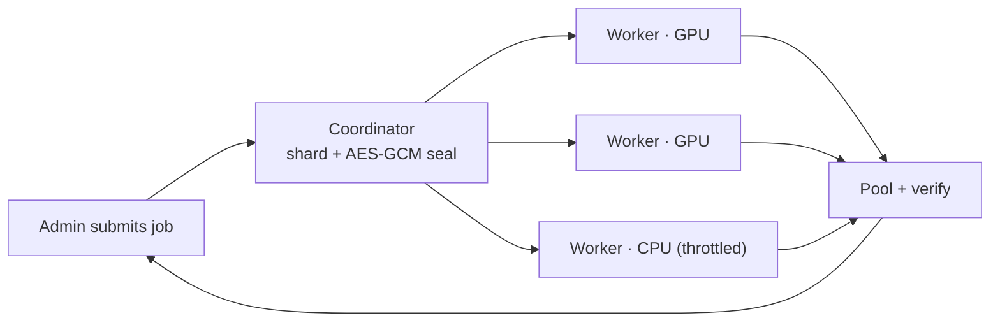

# MoreGPU

[](https://github.com/ArioMoniri/moregpu/actions/workflows/ci.yml)
[](LICENSE)
[](https://ariomoniri.github.io/moregpu/)

MoreGPU is a native GPU compute pool: an admin runs a coordinator, worker machines join with a one-liner over an outbound WebSocket, and submitted jobs are sharded, sealed, computed on each worker's GPU (or CPU), and pooled back with verification.

> ⚠️ **Authorized machines only.** Run MoreGPU on hardware you own or are explicitly permitted to use. Running workers on free or shared third‑party platforms — Google Colab, GitHub Actions and other CI runners, free/trial VPS — is **usually prohibited by their Terms of Service**, and this project ships no tooling to do so. **All legal and compliance responsibility is entirely yours.** See [ACCEPTABLE_USE.md](ACCEPTABLE_USE.md).

<p align="center">
  
</p>

---

## Run it

There are **two roles** — pick yours:

| | 👑 **Admin** | 🖥️ **Worker** |
|---|---|---|
| You… | run the pool's server, hold the tokens, submit jobs | lend a machine's GPU/CPU with a one-liner |
| Go to | [Admin track](#-admin-track) | [Worker track](#-worker-track) |

> Every pool generates its **own** tokens on first run — nobody shares another pool's credentials. Deno is the only prerequisite (one cross-platform binary; the apps run straight from the URL).

---

### 👑 Admin track

**1 · Start the admin server.** First run prints a setup wizard with this pool's tokens and the exact worker command to hand out.

```sh
deno run --allow-net --allow-env --allow-read --allow-write \
  https://raw.githubusercontent.com/ArioMoniri/moregpu/main/apps/coordinator/server.ts
```

<details><summary><b>▶ What to expect · verify it's up · monitor · stop</b></summary>

**Expect:** a colored ASCII wizard printing the **Admin token**, the **Worker join token**, the dashboard URL (`http://HOST:8787`), and a ready-to-paste worker one-liner. Copy the two tokens — the admin token controls the pool; the join token lets machines enroll.

**Verify it's up:**
```sh
curl -s http://localhost:8787/health            # → {"ok":true,"fleet":0,"queue":0}
```
**Monitor:** open `http://HOST:8787` (dashboard: fleet, per-worker contribution + trends, queue, logs), or query the pool as a GPU slot:
```sh
curl -s http://localhost:8787/device -H "authorization: Bearer <admin-token>"
```
**Stop:** `Ctrl-C` in its terminal. Tokens/key persist in `.moregpu-server.json`, so the next start reuses the same pool.

Optional env: `PORT`, `MOREGPU_HOST`, `MOREGPU_TLS_CERT`+`MOREGPU_TLS_KEY` (→ `wss://` TLS), `MOREGPU_DUTY`.
</details>

**2 · Submit a job.** Benchmark mode (the pool generates data), or send your own tensors (data mode).

```sh
curl -X POST http://ADMIN:8787/submit -H "authorization: Bearer <admin-token>" \
  -H "content-type: application/json" -d '{"kernel":"matmul","size":1024}'
```

<details><summary><b>▶ What to expect · send your own data · async · verify</b></summary>

**Expect:** a job record `{"status":"done","gflops":…,"verified":true,"shards":[…]}`. `verified:true` means the pooled GPU result matched the CPU reference.

**Send your own tensors and get results back** (data mode) — easiest via the [SDKs](#use-it-from-your-code):
```python
pool.matmul([1,2,3, 4,5,6], [7,8, 9,10, 11,12], M=2, N=2, K=3)   # → [58, 64, 139, 154]
```
**Async (GPU-style submit + poll):** add `?async=1` to get a job handle immediately, then poll `GET /jobs/<id>`.

Kernels: `matmul, vector_add, vector_mul, saxpy, relu, scale, softmax, layernorm` (extensible). Enough to compose a real transformer block — see [`examples/attention_demo.py`](examples/attention_demo.py) and [AI usage](docs/AI_USAGE.md). The whole fleet is presented as one **virtual GPU slot** — `GET /device` returns its backends, kernels, limits, queue and capabilities.
</details>

The dashboard (any browser, even if the server host is headless/CLI-only) shows the virtual-GPU view, per-worker live contribution + trend sparklines, the queue, and the error/debug log. Turnkey Grafana bundle in [`config/observability`](config/observability). Full ops guide: [docs/ADMIN.md](docs/ADMIN.md).

---

### 🖥️ Worker track

**Join a machine to a pool** with the admin's join token. Installs Deno if needed; uses the GPU (WebGPU → Metal / Vulkan / D3D12) or falls back to CPU. Nothing shows on screen — it only dials **out**.

```sh
# Linux / macOS
curl -fsSL https://raw.githubusercontent.com/ArioMoniri/moregpu/main/scripts/install.sh \
  | MOREGPU_SERVER=wss://ADMIN:8787/ws MOREGPU_TOKEN=<join-token> sh
```
```powershell
# Windows (PowerShell)
$env:MOREGPU_SERVER="wss://ADMIN:8787/ws"; $env:MOREGPU_TOKEN="<join-token>"
irm https://raw.githubusercontent.com/ArioMoniri/moregpu/main/scripts/install.ps1 | iex
```

<details><summary><b>▶ What to expect · verify you joined · monitor your impact · stop · run as a service</b></summary>

**Expect:** log lines like `[worker] <name> · backend=gpu:… · server=wss://…` then `[worker] joined pool · duty ceiling=60% · adaptive …`. It keeps running and pulling work; you'll see `… done in Nms on gpu/cpu` as shards complete.

**Verify you joined:** you appear in the admin's dashboard / `/workers` with your backend and a live contribution **share**. The installer self-heals (retries the Deno install; supervised restart loop).

**Monitor your impact:** the adaptive throttle keeps *total* machine utilization under `MOREGPU_MAX_UTIL` (default 85%) — the harder **you** use your PC, the less the pool takes. Watch the worker log, or your row in the admin dashboard.

**Stop:**
| How you started it | Stop command |
|---|---|
| Foreground | `Ctrl-C` |
| Service (`MOREGPU_SERVICE=1`) | `moregpu stop` · or `systemctl --user stop moregpu-worker` (Linux) · `launchctl unload ~/Library/LaunchAgents/dev.moregpu.worker.plist` (macOS) · `schtasks /end /tn MoreGPUWorker` (Windows) |
| tmux (`MOREGPU_TMUX=1`) | `tmux kill-session -t moregpu` |

**Run as a reboot-surviving, self-healing service:** add `MOREGPU_SERVICE=1` to the one-liner.
</details>

**Worker options** (environment variables):

| Variable | Effect |
|---|---|
| `MOREGPU_SERVICE=1` | Install a reboot-surviving service (systemd / launchd / Windows task); restarts after logout or reboot. |
| `MOREGPU_THROTTLE=0.4` | Duty-cycle **ceiling** (`0.05`–`1`). The effective duty adapts below this from the machine's live load. |
| `MOREGPU_MAX_UTIL=0.85` | Total-utilization cap. The pool uses only the slack below it, backing off as its user gets busier. |
| `MOREGPU_FORCE_CPU=1` (or `--cpu`) | Contribute with CPU only (skip the GPU). |
| `MOREGPU_NAME` | Name for this worker in the dashboard. |
| `MOREGPU_TMUX=1` | Run detached inside a tmux session. |

> **Or use the [`moregpu` CLI](scripts/moregpu)** (installable via Homebrew): `moregpu serve`, `moregpu join --server … --token …`, `moregpu stop`, `moregpu status`, `moregpu monitor`.

---

## Use it from your code

Drive the pool from an application with the client SDK, or the CLI.

```sh
pip install moregpu-client          # Python SDK + `moregpu-client` CLI (stdlib only)
npm install @moregpu/client         # TypeScript/JS SDK (Deno / Node / browser)
brew install --HEAD ariomoniri/moregpu/moregpu   # the `moregpu` CLI (serve / join / stop / monitor)
```

**JavaScript / TypeScript** ([`@moregpu/client`](packages/client), runs in Deno / Node / browsers):

```ts
import { MoreGPUClient } from '@moregpu/client';
const pool = new MoreGPUClient({ baseUrl: 'http://ADMIN:8787', adminToken: '<admin-token>' });
const C = await pool.matmul([1,2,3, 4,5,6], [7,8, 9,10, 11,12], 2, 2, 3); // send tensors, get the product
const { output } = await pool.run('relu', { a: [-1, 2, -3, 4] });         // any kernel on your own data
const gpu = await pool.gpu();                                             // pool state + per-worker contribution
```

**Python** ([`examples/moregpu_client.py`](examples/moregpu_client.py), dependency-free):

```python
from moregpu_client import MoreGPU
pool = MoreGPU("http://ADMIN:8787", "<admin-token>")
pool.matmul([1,2,3, 4,5,6], [7,8, 9,10, 11,12], M=2, N=2, K=3)   # → [58, 64, 139, 154]
pool.run("relu", [-1, 2, -3, 4])                                  # any kernel on your own data
```

For AI/ML workloads — which kernels map to which ops, batching patterns, and how to add a kernel — see [**docs/AI_USAGE.md**](docs/AI_USAGE.md).

## Monitoring (Grafana)

The admin server exposes a Prometheus `/metrics` endpoint (fleet, queue, throughput, and **per-worker contribution**). A turnkey Prometheus + Grafana bundle with a pre-provisioned dashboard is in [`config/observability`](config/observability) — `docker compose up`, then Grafana on `:3000`.

---

## How it works

<p align="center">
  
</p>

<p align="center"><sub>Rendered with <a href="scripts/manim/system.py">Manim</a> · full docs and a lightweight animated version on the <a href="https://ariomoniri.github.io/moregpu/">project site</a>.</sub></p>

**Adaptive per-user throttle.** Each worker samples its own machine's load and lowers its pool duty as that machine's user gets busier, keeping total system utilization under a cap (`MOREGPU_MAX_UTIL`, default 85%). Use the PC harder and the pool quietly steps back, so the user is not disturbed and power draw stays low. CPU-only machines contribute to the same pool. Workers connect outbound only; enrolling a machine never requires opening an inbound port. Set `MOREGPU_SERVICE=1` for reboot survival and the supervised, self-healing restart loop. Provide `MOREGPU_TLS_CERT` and `MOREGPU_TLS_KEY` to serve over `wss://`. Each pool's tokens and encryption key are generated by the wizard on first run, so pools are isolated.

Job flow — submit, shard, seal, compute, pool, verify:



Deployment topology — admin coordinator and outbound-only workers:

<p align="center">
  
</p>

---

## Authorized use only

Run workers only on machines you own or are explicitly authorized to use. MoreGPU is neutral infrastructure and does not provide any automation for turning free CI runners, notebook services, or trial VPS instances into pool workers; using it on third-party platforms is very often prohibited by their Terms of Service. All responsibility, legal risk, and compliance rest entirely with the operator. See the acceptable-use notice above and `LICENSE` for full terms.

## License

Apache-2.0 © 2026 Ariorad Moniri. Repository: https://github.com/ArioMoniri/moregpu

The software is provided AS IS, without warranty of any kind, and the authors accept no liability.
